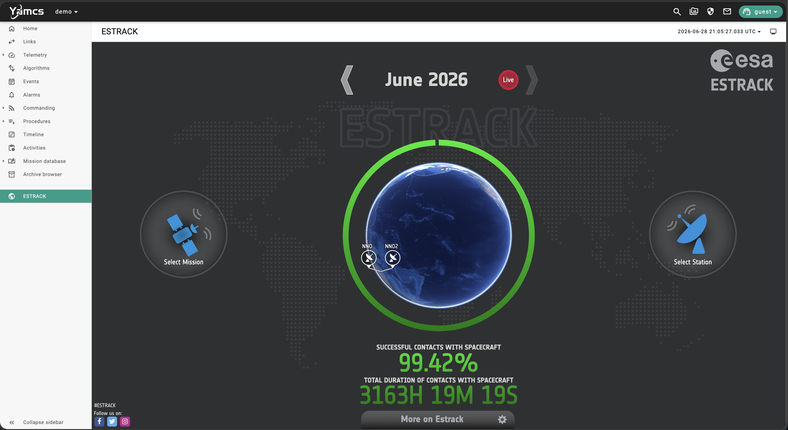

# Yamcs external-webpage plugin

A small, externally-distributed [Yamcs](https://yamcs.org) plugin that adds an item to the
yamcs-web sidebar which embeds an **external webpage** in the main content area. The sidebar
**name** and the **URL** are set in a config file — no rebuild needed to change them — and
visibility is gated by a Yamcs **system privilege**.

The bundled Docker demo configures it as **ESTRACK** → <https://estracknow.esa.int/>, but
that is just example configuration; point it at any site you like.



---

## Configuring the name and URL

Everything user-facing lives in one config file, **`etc/external-webpage.yaml`**:

```yaml
label: My Page                 # <- the name shown in the sidebar
url: https://example.com/      # <- the page embedded in the main area
privilege: web.ExternalPage    # who may see it (assignable to roles; superusers always do)
group: archive                 # sidebar group (archive recommended)
icon: public                   # Material Symbols icon name
order: 0                       # sort hint among extension items
```

`label` and `url` are read by Yamcs at startup and passed to the web UI, so editing them and
restarting is all it takes — no recompilation. You can set them **before installing** (edit
`config/external-webpage.yaml`, which the installer copies into `etc/`) or **after** (edit
the copy in your deployment's `etc/`).

| Key         | Required | Default            | Description                                |
|-------------|----------|--------------------|--------------------------------------------|
| `label`     | yes      | —                  | Sidebar text (the name).                   |
| `url`       | yes      | —                  | External page embedded in an iframe.       |
| `privilege` | no       | `web.ExternalPage` | System privilege required to see the item. |
| `group`     | no       | `archive`          | Sidebar group; `archive` is recommended.   |
| `icon`      | no       | `public`           | Material Symbols icon name.                |
| `order`     | no       | `0`                | Sort hint among extension items.           |

---

## How it works

yamcs-web is a compiled Angular app, but it has a first-class extension mechanism that does
**not** require rebuilding yamcs-web:

1. **Java plugin** (`plugin/`, artifactId `external-webpage`) — on startup it reads
   `etc/external-webpage.yaml`, registers the configured system privilege with the security
   module, and calls `WebPlugin.addExtension(id, config, staticRoot)`, handing yamcs-web a
   prebuilt web bundle plus the configuration. Yamcs auto-injects the bundle into
   `index.html` and exposes the config to the web app.
2. **Web extension** (`web-extension/`) — an Angular Elements custom element
   (`<external-webpage>`) built against `@yamcs/webapp-sdk`. yamcs-web instantiates it at
   startup to register the sidebar item (with a privilege `condition`), and again for the
   page route `/<instance>/ext/external-webpage`, where it renders the real yamcs
   `ya-instance-toolbar` (showing the configured label and the live mission/processor time)
   above an `<iframe>` of the URL. The toolbar reaches the main app's services through the
   SDK's `SdkBridge`, wired up by the `YamcsWebExtension` base class.

The plugin name (`external-webpage`), the custom-element tag, and the route id are all the
same string by design — that linkage wires the three pieces together. The name and URL are
**not** part of that linkage; they are pure configuration.

### Things to know

- **Where the item appears:** the yamcs-web sidebar is *instance-scoped*. The item shows up
  **after you open an instance**, as a standalone entry at the bottom of the left sidebar
  (the `archive` nav group). It is not an app-wide top-level entry (that would require
  forking yamcs-web).
- **iframe embedding:** the target site must allow being framed. Sites sending
  `X-Frame-Options: DENY/SAMEORIGIN` or a restrictive CSP `frame-ancestors` will refuse to
  embed. `estracknow.esa.int` (the demo URL) currently sends neither.
- **Privilege gating is client-side** visibility of the menu item and page. It does not
  authenticate the external site, which keeps its own access control.

---

## Quick start (Docker demo)

Runs a self-contained Yamcs (v5.13.0) with the plugin pre-installed, configured as ESTRACK.

```bash
docker compose -f docker/docker-compose.yml up --build
```

Then open <http://localhost:8090>, open the **demo** instance, and look for **ESTRACK** at
the bottom of the left sidebar. To show a different page, edit
`demo/src/main/yamcs/etc/external-webpage.yaml` and restart.

(The demo runs with default access — the unauthenticated user is a superuser — so the item
is visible immediately. See `demo/src/main/yamcs/etc/security.yaml.example` for how the
privilege gates non-superusers.)

---

## Install from a pre-compiled release (no build)

The easiest path: grab a packaged build from the
[Releases page](https://github.com/Meridian-Space-Command/yamcs-web-plugin-webpage/releases).
Each release attaches a **lite bundle** zip,
`external-webpage-<ver>-yamcs-<yamcsVer>-bundle.zip`, containing just the jar, the config
template, `install.sh`, and `INSTALL.md` — plus GitHub's automatic "Source code" archives.

```bash
unzip external-webpage-1.0.0-yamcs-5.13.0-bundle.zip
cd external-webpage-1.0.0-yamcs-5.13.0-bundle
./install.sh /path/to/your/yamcs      # copies the jar + config into your Yamcs
```

Pick the release whose `yamcs-<ver>` suffix matches your server's Yamcs version.

**Cutting a release** (maintainers): push a version tag and the
[`release` workflow](.github/workflows/release.yml) builds and publishes everything:

```bash
git tag v1.0.0 && git push origin v1.0.0
```

Or build the bundle locally with `bash scripts/package-release.sh` (output in `dist/`).

---

## Installing from source

Requirements: JDK 17+, Maven, and (for the build) network access to download Maven and Node
artifacts.

```bash
# Build the plugin jar (also builds the web bundle via frontend-maven-plugin):
mvn -pl plugin -am -DskipTests package

# Install into your Yamcs home (the dir containing bin/, etc/, lib/):
./install.sh /path/to/your/yamcs
# ...or build + install in one step:
./install.sh --build /path/to/your/yamcs
```

The script copies the plugin jar into `<yamcs>/lib/` (auto-loaded from the classpath) and
`config/external-webpage.yaml` into `<yamcs>/etc/` (only if not already present). Then:

1. Edit `etc/external-webpage.yaml` to set your `label` (name) and `url`.
2. Grant the configured privilege (default `web.ExternalPage`) to a role, or sign in as a
   superuser.
3. Restart Yamcs.

---

## Project layout

```
pom.xml                          Parent Maven project
plugin/                          Java Yamcs plugin (artifactId = external-webpage)
web-extension/                   Angular Elements custom element (ng build → dist/bundle/)
config/external-webpage.yaml     Config template (installed into etc/)
install.sh                       Installer for an existing Yamcs home
docker/                          Multi-stage Dockerfile + compose for the demo
demo/                            Minimal runnable Yamcs that bundles the plugin (as ESTRACK)
```

---

## Building just the web extension

```bash
cd web-extension
npm install
npm run build      # ng build + finalize -> dist/bundle/ (main.js + manifest.txt)
npm run typecheck  # optional type check
```

## Renaming the plugin / running several pages

This package ships a single page named `external-webpage`. The displayed name and URL are
configuration, so you usually only edit `etc/external-webpage.yaml`. To run a *second*,
independent page (its own sidebar entry and privilege) you need a second plugin with a
distinct id: change the plugin `artifactId`, the `TAG` constants in
`web-extension/src/main.ts` and `web-extension/src/external-webpage.component.ts`, and the
`CONFIG_SUBSYSTEM` in the Java plugin to a new hyphenated name, then rebuild — those
identifiers must stay equal to each other.

## Compatibility

Targets Yamcs **5.13.0**, which ships `@yamcs/webapp-sdk` **1.4.0** on **Angular 21**. Because
the web extension uses real SDK components (`ya-instance-toolbar`) via the official
`provideYamcsWebExtension()` helper, it is **version-coupled**: when you move to another Yamcs
release, update `yamcsVersion` in the parent `pom.xml` **and** the `@yamcs/webapp-sdk` /
`@angular/*` versions in `web-extension/package.json` to match that release's
`yamcs-web/src/main/webapp/projects/webapp-sdk/package.json`. `WebPlugin.addExtension` is
marked `@Experimental` upstream.
